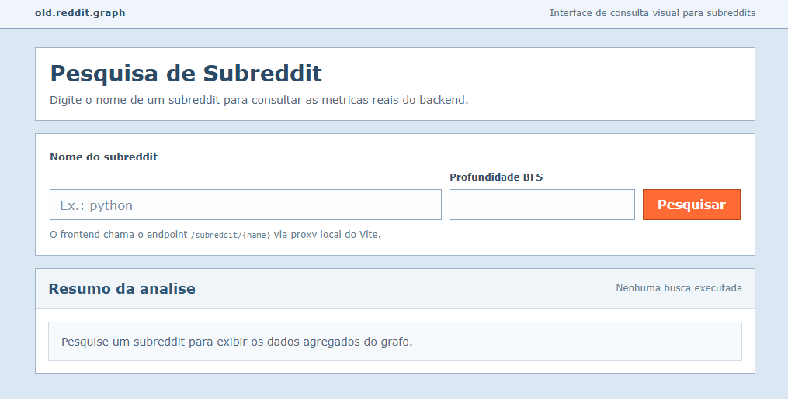
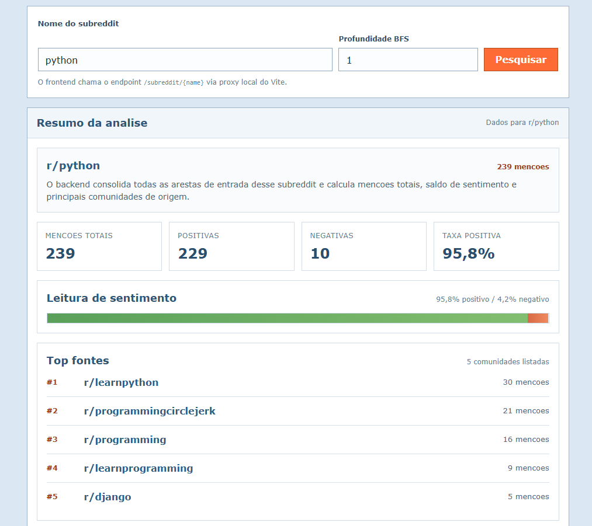
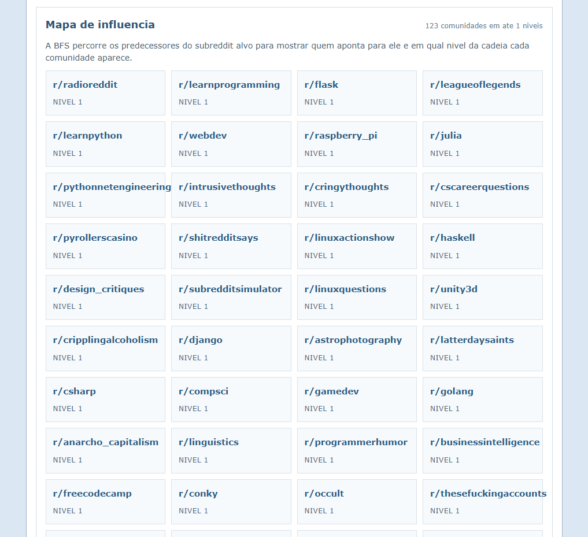

# G2_Grafos_PA-26.1

Conteúdo da Disciplina: Grafos

## Alunos
| Matrícula | Aluno |
| -- | -- |
| 231035446 | Lucas Monteir Freitas |
| 231011533 | João Maurício Pilla Nascimento |

## Sobre
Este projeto analisa relações entre subreddits a partir de um grafo direcionado construído com o dataset `soc-redditHyperlinks`.

No backend, cada aresta representa uma referência de um subreddit de origem para um subreddit de destino, com informações de sentimento e timestamp. A aplicação permite:

- consultar métricas agregadas de um subreddit;
- contar menções positivas e negativas;
- listar as principais comunidades que apontam para o subreddit buscado;
- executar uma BFS reversa para identificar quem cita ou influencia um subreddit até uma profundidade informada.

O frontend consome esses dados e exibe uma interface de busca para visualizar o resumo da análise e o mapa de influência retornado pelo backend.

## Screenshots




## Instalação
Linguagem: Python e TypeScript
Framework: FastAPI e React + Vite

### Pré-requisitos

- Python 3.8 ou superior
- Node.js 20 ou superior
- npm 10 ou superior

### Backend

Na raiz do projeto, execute:

```bash
python setup.py
```

Esse comando:

- cria o ambiente virtual `venv`;
- instala as dependências do backend listadas em `requirements.txt`;
- baixa os arquivos do dataset para `backend/data/`;
- inicia a API FastAPI em `http://127.0.0.1:8000`.

### Frontend

Em outro terminal, execute:

```bash
cd frontend
npm install
npm run dev
```

O frontend ficará disponível no endereço informado pelo Vite, normalmente `http://127.0.0.1:5173`.

## Uso
1. Inicie o backend com `python setup.py`.
2. Inicie o frontend com `npm run dev` dentro da pasta `frontend`.
3. Acesse a interface no navegador.
4. Digite o nome de um subreddit, como `python`.
5. Consulte o resumo da análise, incluindo total de menções, sentimento e top fontes.
6. Ajuste a profundidade da BFS para visualizar o mapa de influência do subreddit pesquisado.

Também é possível testar diretamente a API pelos endpoints:

- `GET /subreddit/{name}`
- `GET /influence/{name}?depth=2`

A documentação interativa do backend fica em:

```text
http://127.0.0.1:8000/docs
```

## Outros

- Na primeira execução, o processo pode demorar alguns minutos por causa da instalação das dependências e do download do dataset.
- Se os arquivos já existirem em `backend/data/`, o download é ignorado.
- O projeto usa um grafo direcionado para representar citações entre subreddits e uma BFS reversa para explorar predecessores de um subreddit alvo.

## Video
- https://youtu.be/Yb56BMqA_SU